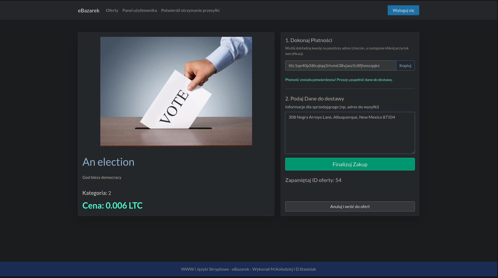

# ebazarek

## Your one stop shop for selling baking soda.

*NOTE: This work is a parody of the real life underground marked called silk
road. It doesn't intend to glorify the use of illegal substances, but is a
simple and yet unsecure implementation of a crypto bazaar.*

### Preview

### Bugs

1. Have to change ./website/instance & ./website/instance/bazabazarka.sqlite 
owner to www-data manually, as Dockerfile seems confused.

2. Have to set permissions for the upload folder manually, same reason as above.

2. While the code that checks for completed transactions can add up all the
different ones - thus allowing for multiple small payments to be made - the 
transaction verification code only looks at the txid of one address, 
bricking it.

### Dependencies

https://github.com/leto-ux/ltx
This wrapper for now assumes the use of a static revceiving address and the
usage being bound to docker.
